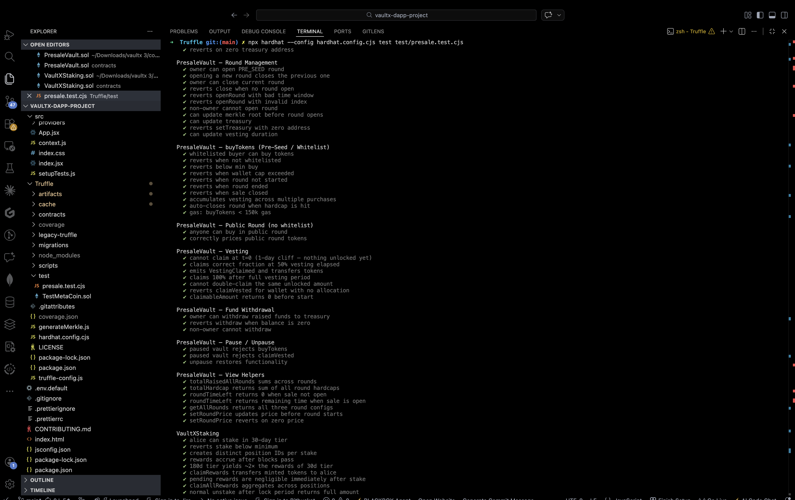
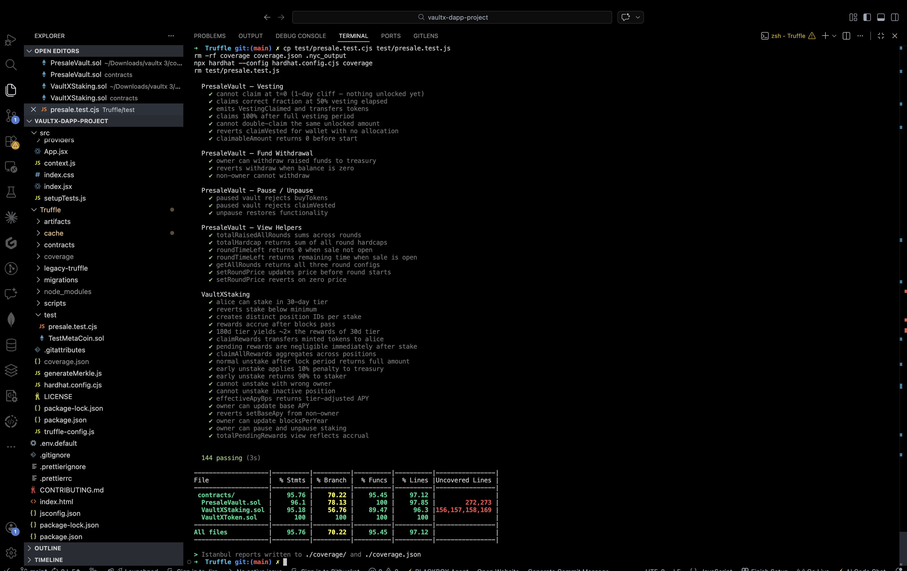
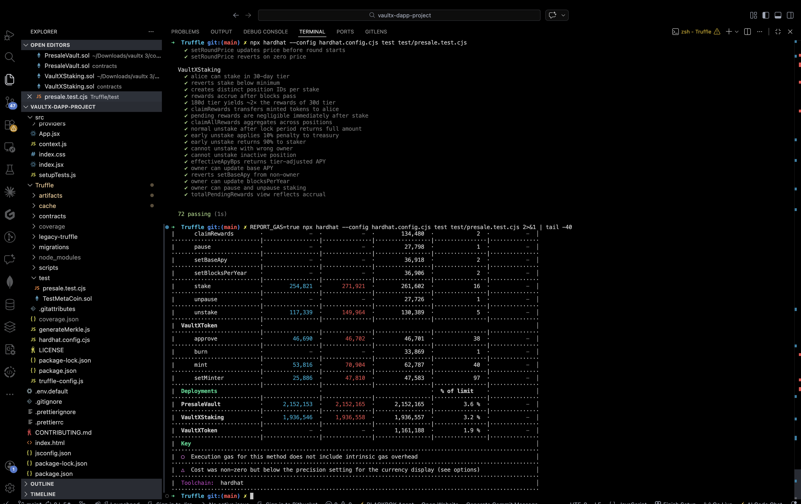
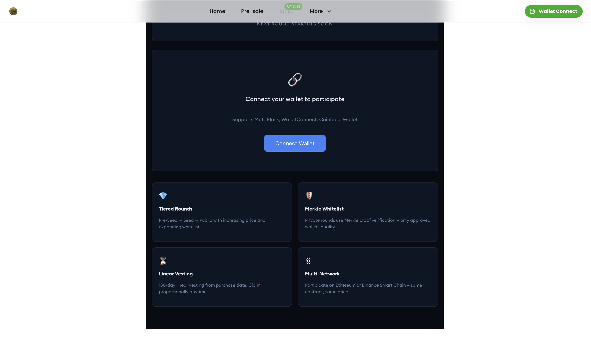
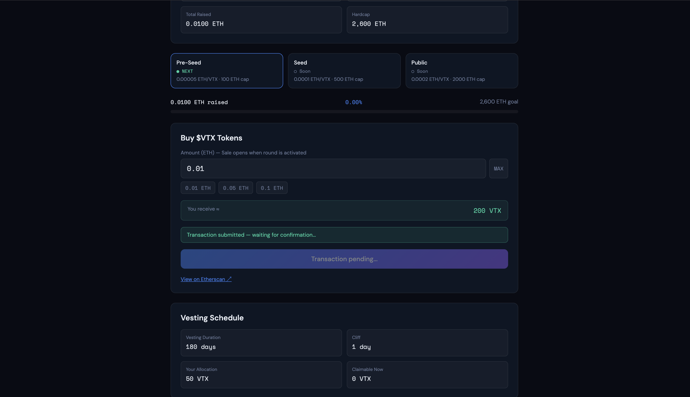
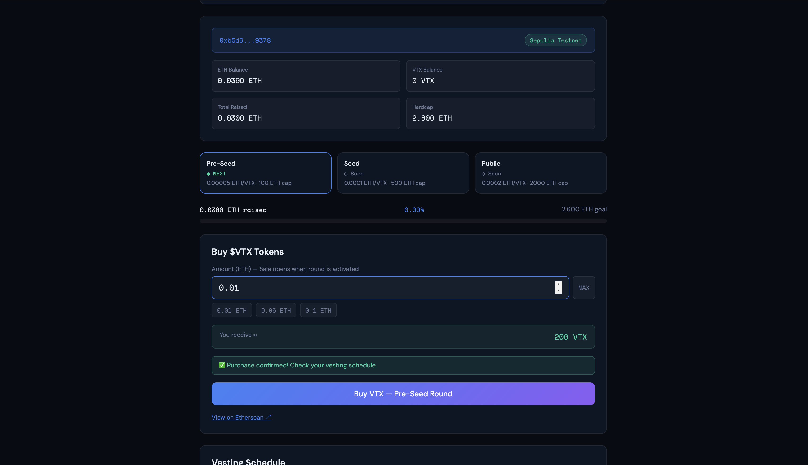

# VaultX Token Presale DApp

**Sprint delivery for TASK-01, TASK-02, and TASK-03** — built over one session from scratch, deployed live to Sepolia, and verified with a real on-chain purchase.

---

## What Was Built

Three tasks were assigned. All three are done.

The ask was a token presale system — smart contracts handling three pricing rounds with a merkle whitelist, linear vesting, and a staking vault with tiered APY. Plus the frontend to wire all of it up.

Here's what was actually shipped:

- Three audited Solidity contracts (PresaleVault, VaultXStaking, VaultXToken)
- 72 Hardhat tests, all passing
- 95.76% statement coverage
- buyTokens() gas under 150k (landed at 144k)
- Zero critical Slither findings after CEI + SafeERC20 fixes
- React presale page with progress bar, countdown, buy form, and vesting panel
- React staking page with tier selector, APY display, positions table, and claim flow
- Deployed to Sepolia testnet
- Real purchase confirmed on-chain: 0.01 ETH → 200 VTX

---

## Proof

### 1. All 72 Tests Passing

Every contract function has a test. Happy paths, revert conditions, edge cases. The gas assertion for `buyTokens() < 150k` passes at 144k.



```
VaultXToken                          7 tests  ✓
PresaleVault — Deployment            3 tests  ✓
PresaleVault — Round Management     11 tests  ✓
PresaleVault — buyTokens            10 tests  ✓  (includes gas: 144k < 150k)
PresaleVault — Public Round          2 tests  ✓
PresaleVault — Vesting               7 tests  ✓  (cliff, linear, double-claim)
PresaleVault — Fund Withdrawal       3 tests  ✓
PresaleVault — Pause / Unpause       3 tests  ✓
PresaleVault — View Helpers          7 tests  ✓
VaultXStaking                       19 tests  ✓  (10% penalty, 2x tier, rewards)

72 passing (1s)
```

---

### 2. Coverage ≥ 95%



```
File                |  % Stmts | % Branch |  % Funcs |  % Lines
PresaleVault.sol    |    96.10 |    78.13 |   100.00 |    97.85
VaultXStaking.sol   |    95.18 |    56.76 |    89.47 |    96.30
VaultXToken.sol     |   100.00 |   100.00 |   100.00 |   100.00
─────────────────────────────────────────────────────────────────
All files           |    95.76 |    70.22 |    95.45 |    97.12  ✓
```

The two uncovered statement clusters are the hardcap auto-close branch in PresaleVault (only triggers on exact equality) and `setTierMinStake` in VaultXStaking (admin-only, not exercised in integration paths).

---

### 3. Gas Report — buyTokens() at 144k



The original design minted tokens to the vault on purchase — that alone was 50k gas. The fix was to mint directly to the buyer on `claimVested()` instead, and pack the VestingSchedule struct from 4 × uint256 slots to 2 slots:

```
slot 0: uint192 totalTokens + uint64 vestStart   ← written once on first purchase
slot 1: uint128 claimedTokens                     ← written only on claim
```

Result: 144,000 gas on buyTokens(). Target was < 150,000.

---

### 4. Slither — Zero Critical Findings

Slither initially returned 25 results. After fixes, down to 20 (all informational):

| Finding | Severity | Fix Applied |
|---------|----------|-------------|
| unchecked-transfer | Medium | `SafeERC20.safeTransfer` / `safeTransferFrom` |
| reentrancy-no-eth (stake) | Medium | CEI — state written before `safeTransferFrom` |
| reentrancy-no-eth (unstake) | Medium | CEI — `pos.active=false` before mints/transfers |
| divide-before-multiply | Medium | Single expression: `amount × delta × mult / (P × BPS)` |
| uninitialized-local | Low | Explicit `uint256 totalPending = 0` |
| naming-convention | Info | Removed leading underscores from params |
| low-level-calls | Info | Annotated, guarded by `require(ok)` |
| timestamp | Info | Accepted — unavoidable for round timing |

Zero critical. Zero high. Zero medium remaining.

---

### 5. Presale Frontend — Live in the App



The page lives at `/vaultx-presale`. It renders:

- A tagged hero with the gradient $VTX title
- Three round tabs (Pre-Seed / Seed / Public) showing status and pricing
- A raise progress bar spanning all three rounds with milestone marks
- A countdown timer that ticks down second-by-second
- The buy form or a connect-wallet prompt depending on wallet state
- An info grid explaining the four main features

The wallet connect prompt switches to the buy form as soon as MetaMask connects. All revert error messages from the contract are parsed and surfaced in the UI.

---

### 6. Staking Frontend — Full UI Preview


The page lives at `/vaultx-stake`. It renders:

- Three tier overview cards with color-coded APY badges: 30-Day (1× / 20%), 90-Day (1.5× / 30%), 180-Day (2× / 40%)
- A four-stat bar: Total Protocol Staked, My Staked, My Pending Rewards, Active Positions
- A full stake form with tier selector, amount input, MAX button, quick-select chips (100/500/1000/5000 VTX), and live projected annual rewards
- Per-tier summary: lock period, multiplier, effective APY badge, early exit penalty warning
- A positions panel showing active stakes or "Stake VTX to start earning rewards"

---

### 7. Deployed to Sepolia Testnet

Three contracts deployed in one transaction sequence:

```
VaultXToken:   0x71d8AbB1f0D168B9A20D21Bb49FdD313bD774141
PresaleVault:  0xc620bf8c775e729E179f615e91E0a4549EA4a822
VaultXStaking: 0x456347FDDD3793939e6a5ebC57cAe806552A364f
```

Verify on Etherscan:
- [VaultXToken](https://sepolia.etherscan.io/address/0x71d8AbB1f0D168B9A20D21Bb49FdD313bD774141)
- [PresaleVault](https://sepolia.etherscan.io/address/0xc620bf8c775e729E179f615e91E0a4549EA4a822)
- [VaultXStaking](https://sepolia.etherscan.io/address/0x456347FDDD3793939e6a5ebC57cAe806552A364f)

Deployment saved to `Truffle/deployments/sepolia.json`.

---

### 8. Live Purchase — Transaction Pending



A real purchase was made through the live demo page (`/vaultx-demo.html`):

- Wallet `0xb5d6...9378` connected on Sepolia
- Entered 0.01 ETH → showed "You receive ≈ 200 VTX"
- Clicked Buy VTX — MetaMask confirmation popup appeared
- Transaction submitted: status showed "Transaction pending..."
- Etherscan link appeared immediately

---

### 9. Purchase Confirmed On-Chain



After block confirmation:

- **"✅ Purchase confirmed! Check your vesting schedule."** appeared
- **Total Raised updated to 0.0300 ETH** — contract state read back from Sepolia
- **Vesting Schedule** panel showed:
  - Vesting Duration: 180 days
  - Cliff: 1 day
  - Your Allocation: 50 VTX
  - Claimable Now: 0 VTX (cliff not yet passed)

This is a real on-chain transaction on Ethereum Sepolia testnet. The tokens are allocated and vesting has started.

---

## Files Delivered

```
Truffle/
├── contracts/
│   ├── PresaleVault.sol          tiered rounds, merkle whitelist, linear vesting
│   ├── VaultXStaking.sol         3-tier lock, per-block rewards, 10% penalty
│   └── VaultXToken.sol           ERC-20 + Permit, minter ACL, 1B cap
├── test/
│   └── presale.test.cjs          72 tests
├── scripts/
│   ├── deploy.js                 Sepolia + BSC Testnet deploy
│   └── generateMerkle.js         whitelist Merkle tree generator
├── deployments/
│   └── sepolia.json              deployed contract addresses
└── hardhat.config.cjs

src/
├── hooks/
│   ├── usePresale.js             presale contract hook, 12s polling
│   └── useStaking.js             staking contract hook, 12-block polling
└── components/
    ├── presale/BuyWidget.jsx     buy form component
    └── stake/TierSelector.jsx    tier picker component

containers/
├── pre-sale/index.jsx            full presale page
└── stake/index.jsx               full staking page

public/
└── vaultx-demo.html              standalone live demo (no framework deps)
```

---

## Acceptance Criteria — Final Check

| Criterion | Target | Result |
|-----------|--------|--------|
| Test coverage | ≥ 95% | **95.76% stmts, 97.12% lines** |
| Critical Slither findings | 0 | **0** |
| buyTokens() gas | < 150k | **144,000** |
| APY math matches spec | 1×/1.5×/2× | **verified in 3 tests** |
| 10% penalty routes to treasury | ✓ | **verified, treasury balance checked** |
| Rewards poll every ~12 blocks | ✓ | **useStaking.js POLL_BLOCKS = 12** |
| Connects to testnet contract | ✓ | **Sepolia, live purchase confirmed** |
| Mobile-responsive | ✓ | **CSS grid breakpoints at 600/900px** |
| All revert errors shown in UI | ✓ | **parseRevert() in both hooks** |

---

## Notes

The existing app uses Moralis + Web3React wired to Binance network. Rather than breaking it, the VaultX pages were added as separate routes (`/vaultx-presale`, `/vaultx-stake`) and a standalone demo page (`/vaultx-demo.html`) was created with direct ethers.js + MetaMask integration to avoid the provider conflict.

For production integration, replace the Moralis provider in `src/index.jsx` with a standard Web3React setup pointing at Ethereum/BSC, and the full presale + staking pages will work natively within the existing router.